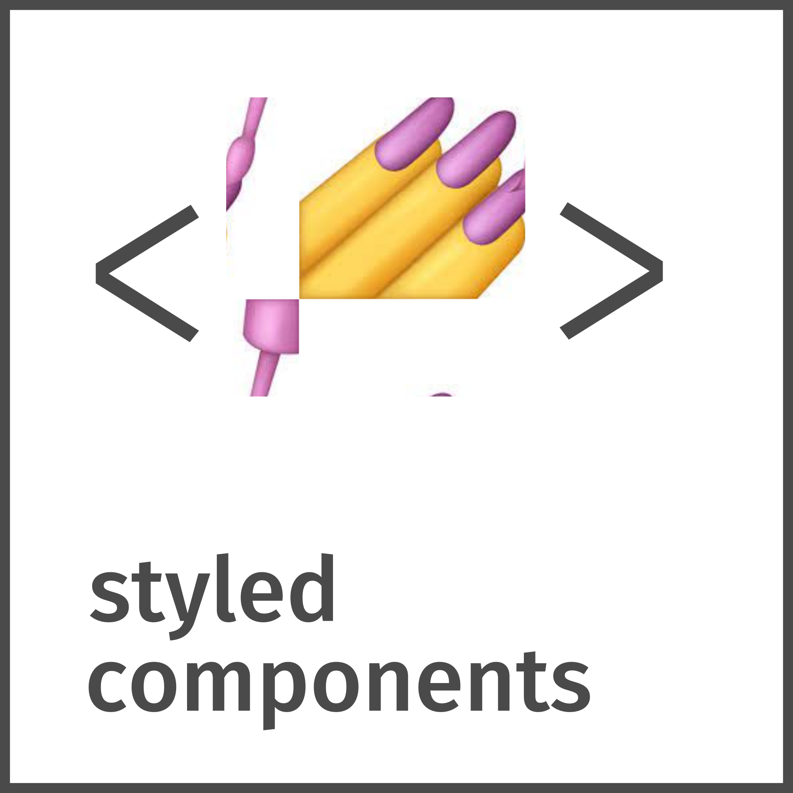

# Hi there  I'm Marcelo!

A **Front-End Developer** with experience in building responsive, accessible websites and web applications.
I'm always studying, learning new technologies and improving my skill set.

## Languages and Tools:

## About me:

:mortar_board: Graduated in Business School

:computer: Studying Analysis and Systems Development

:books: Currently studying React, NextJs and TypeScript

:video_game: I love videogames and movies

## Connect with me:

